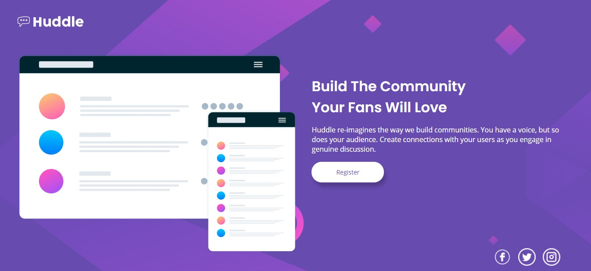
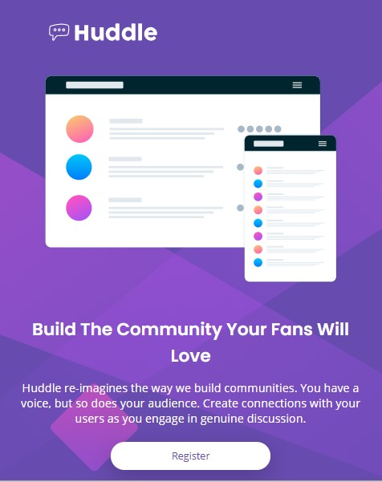
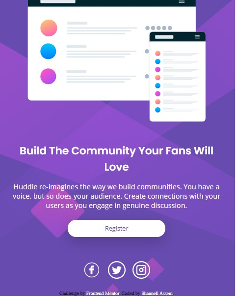

# Frontend Mentor - Huddle landing page with single introductory section solution

This is a solution to the [Huddle landing page with single introductory section challenge on Frontend Mentor](https://www.frontendmentor.io/challenges/huddle-landing-page-with-a-single-introductory-section-B_2Wvxgi0). Frontend Mentor challenges help you improve your coding skills by building realistic projects. 

## Table of contents

- [Overview](#overview)
  - [The challenge](#the-challenge)
  - [Screenshot](#screenshot)
  - [Links](#links)
- [My process](#my-process)
  - [Built with](#built-with)
  - [What I learned](#what-i-learned)
  - [Continued development](#continued-development)
  - [Useful resources](#useful-resources)
- [Author](#author)


## Overview

### The challenge

Your challenge is to build out this landing page.

Users should be able to:

- View the optimal layout for the page depending on their device's screen size
- See hover states for all interactive elements on the page

### Screenshot






### Links

- Solution URL: [Add solution URL here](https://your-solution-url.com)
- Live Site URL: [Add live site URL here](https://your-live-site-url.com)

## My process

### Built with

- Semantic HTML5 markup
- CSS custom properties
- Sass
- Flexbox
- Mobile-first workflow


### What I learned

I learned how flexbox makes postioning easier. At first I was stuck on how I was going to move my social media icons to the right. Flex-end made it super easy.


```scss
.social {
        margin-right: 4em;
        justify-content: flex-end;
        position: relative;
        top: -5em;
    }
```


If you want more help with flexbox, check out [The Flexbox Guide](https://byteiota.com/flexbox-conatiner/) to learn more.


### Continued development

I'm improving in my skills when it comes to flexbox. I want to keep practicing with different kinds of flexbox and positioning. 

I also need to continue with trying to ind ways to simplify my codes. I tend to overcomplicates this, but I had some control this time. 

### Useful resources

- [Icons](https://iconscout.com/) - I always get my icons from here. You even have to option to change the color. 
- [Flexbox Guide](https://byteiota.com/flexbox-conatiner/) - This is was a life savor for me. I like the visuals so that I know which one I want to use.


## Author

- Website - [Add your name here](https://www.your-site.com)
- Frontend Mentor - [@yourusername](https://www.frontendmentor.io/profile/yourusername)


